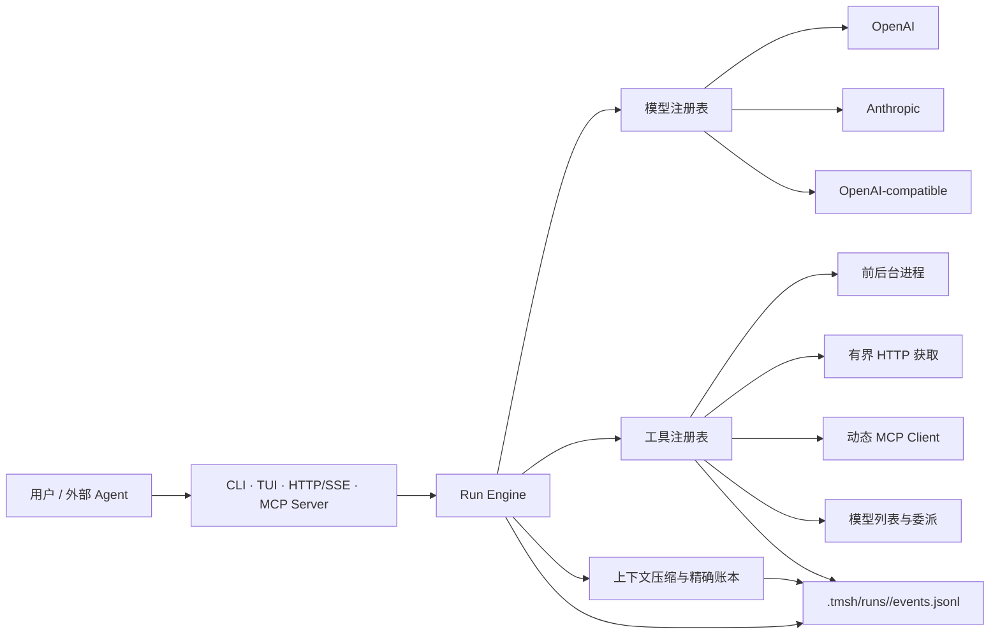

# TMSH：The Most Simplest Harness

> 一个极薄、本地优先、由模型自主决策的 AI Harness。TMSH 只提供模型无法凭空获得的接口、约束与可观察反馈；任务规划、步骤拆解、工具选择、模型选择、失败恢复、结果验证和停止时机都交给模型自己决定。

[](https://nodejs.org/)
[](https://www.typescriptlang.org/)
[](LICENSE)

当前版本：`0.1.0`

## 这是什么

多数 AI Agent 框架会逐渐加入工作流 DSL、固定多智能体拓扑、专用规划器、路由器、长期记忆、网页工作台和大量领域逻辑。TMSH 选择相反方向：**Harness 应当尽可能简单，智能应当尽可能留在模型中。**

TMSH 的核心职责只有三类：

1. **接入**：统一连接模型、MCP、HTTP、系统进程、CLI、TUI 和本地 API。
2. **反馈**：把模型输出、工具调用、进程输出、审批、用量、错误和压缩结果写入同一条事件流。
3. **守住不可丢失的状态**：在上下文压缩时，把结论性叙述交给模型，把精确数值、失败结果、Git 状态和下一验证步骤交给运行时校验。

除此之外，TMSH 不替模型写死“应该怎样工作”。常驻行为规范位于 [`TMSH.md`](TMSH.md)：模型在进入一个项目后应先联网调研，再结合项目实际创建项目本地的 `AGENTS.md` 和必要的窄技能；只有遇到真实、可复用且现有工具无法完成的能力缺口时，才激活休眠的 `adaptive-toolsmith`。

## “最简单”具体指什么

“最简单”不是功能残缺，也不是让模型无约束地运行，而是把边界放在正确的位置：

| Harness 负责                                         | 模型负责                             |
| ---------------------------------------------------- | ------------------------------------ |
| 暴露可用模型及其能力、成本等级、上下文容量和可用状态 | 判断当前任务该用哪个模型             |
| 提供有界的模型委派接口                               | 决定是否委派、委派给谁、如何综合结果 |
| 提供进程、HTTP、MCP 等原子工具                       | 决定调用顺序、参数、重试和替代方案   |
| 记录追加式事件和精确保存账本                         | 判断证据是否足够、何时完成           |
| 在阈值处请求并验证上下文压缩                         | 生成 RE-TRAC 风格的叙述性压缩        |
| 提供 `confirm` 与显式 `yolo` 两种权限模式            | 在可见约束内自主执行                 |

TMSH **刻意不包含**：工作流 DSL、固定多智能体图、训练式路由器、向量数据库、编辑器、Git 工作台、Web UI、插件市场和领域规划器。若模型能够依据可见状态作出决定，Harness 就只暴露状态和动作，不把决定固化为代码。

## 架构概览



CLI、TUI、HTTP/SSE 和 MCP Server 只是同一运行核心的不同入口；它们观察的是同一套运行状态与事件，不各自实现另一套 Agent 逻辑。

## 已实现能力

- OpenAI、Anthropic、OpenAI-compatible 模型适配器，以及用于确定性测试的 fake adapter。
- 模型可见的模型注册表与有界 `model.delegate`；没有固定路由器。
- 10 个内置模型工具，并可通过 MCP 动态发现更多工具。
- 结构化前台/后台命令执行、增量等待、标准输入、超时、停止和输出截断。
- 有重定向、字节数、超时限制的 HTTP/HTTPS 页面获取；需要原始 `curl` 时可走进程工具。
- MCP stdio 与 Streamable HTTP 客户端，以及把 TMSH 暴露给外部 Agent 的 stdio MCP Server。
- CLI、HTTP/SSE API、由 Bun 驱动的原生 OpenTUI，以及原生 FFI 不可用时的 ANSI TUI 回退。
- `/api`/`tmsh api` 本地配置向导：隐藏输入密钥、认证后枚举模型、多选并热接入当前 TUI。
- `.tmsh/sessions/` 本地长期会话与 `/resume` 恢复，完整继承模型消息和精确 ledger。
- RE-TRAC 风格叙述压缩 + SHA-256 校验的无损精确账本。
- 显式 `--yolo` 自主模式，同时保留审计、资源限制、凭据边界和压缩完整性校验。
- 休眠、固定来源版本的 `adaptive-toolsmith` 基础插件。

## 环境要求

- Node.js `22` 或更高版本
- pnpm
- [Bun](https://bun.sh/docs/installation)（推荐；用于原生 OpenTUI。没有 Bun 时其他命令和 ANSI TUI 仍可运行）
- 至少一个已配置且可用的模型 API；只查看帮助、运行测试或使用 fake adapter 时不需要真实密钥

检查本机版本：

```powershell
node --version
pnpm --version
```

## 快速开始

### Windows PowerShell

```powershell
git clone https://github.com/Zhen-WushuiLingchun/simplest_harness.git
Set-Location simplest_harness

pnpm install
pnpm build
npm install -g bun

pnpm start api
pnpm start doctor --config tmsh.local.json
pnpm start tui --config tmsh.local.json --yolo
```

### Linux / macOS

```sh
git clone https://github.com/Zhen-WushuiLingchun/simplest_harness.git
cd simplest_harness

pnpm install
pnpm build
curl -fsSL https://bun.com/install | bash

pnpm start api
pnpm start doctor --config tmsh.local.json
pnpm start tui --config tmsh.local.json --yolo
```

`tmsh api` 会让用户先选择提供商，再隐藏输入 API Key，向该提供商的模型枚举端点认证，并让用户多选一个或多个模型。模型描述写入 `tmsh.local.json`，Key 写入 `tmsh.local.env`。两者以及 `.tmsh/` 运行数据均已加入 `.gitignore`。

`tmsh.local.env` 是用户明确选择的本地明文便利方案：TMSH 会尽量收紧文件权限，但 Windows 的 `chmod` 不等价于 POSIX `0600`。真实密钥不会进入模型描述、事件、Prompt、fixture 或 Git；仍需保护本机用户账户和工作目录。

如果已经把本项目安装为全局或可执行包，可直接把 `pnpm start` 换成 `tmsh`。在源码仓库内开发时，也可以使用 `pnpm dev` 直接运行 TypeScript 入口。

## 第一次运行

执行一个一次性任务：

```powershell
pnpm start run "先调研当前项目，再检查测试并报告证据" --config tmsh.local.json --yolo
```

进入交互式 TUI：

```powershell
pnpm start tui --config tmsh.local.json --yolo
```

在真实交互终端中，`tmsh tui` 如果发现 Bun，会自动用 Bun 重启自身并进入原生 OpenTUI；这与 OpenCode 当前使用 OpenTUI 的运行路线一致。源码仓库也提供显式命令：

```powershell
pnpm tui -- --config tmsh.local.json --yolo
```

只查看配置、模型和工具是否就绪：

```powershell
pnpm start doctor --config tmsh.local.json
pnpm start models --config tmsh.local.json
pnpm start tools --config tmsh.local.json
```

## CLI 命令

```text
tmsh api [--config PATH]
tmsh run "goal" [--model ID] [--workspace PATH] [--yolo] [--config PATH]
tmsh tui ["initial goal"] [--model ID] [--workspace PATH] [--yolo] [--config PATH]
tmsh serve [--yolo] [--config PATH]
tmsh mcp [--config PATH]
tmsh models [--config PATH]
tmsh tools [--config PATH]
tmsh doctor [--config PATH]
```

| 命令     | 用途                                                                |
| -------- | ------------------------------------------------------------------- |
| `api`    | 隐藏输入 Key、枚举模型并更新本地忽略配置                            |
| `run`    | 启动一个任务，输出运行事件和最终结果                                |
| `tui`    | 启动交互式终端界面，可连续提交并恢复长期会话                        |
| `serve`  | 启动 loopback HTTP/SSE API，默认 `127.0.0.1:4097`                   |
| `mcp`    | 通过 stdio 启动 TMSH MCP Server                                     |
| `models` | 列出模型描述、能力、上下文容量和当前可用性                          |
| `tools`  | 列出当前模型可见的内置与 MCP 工具                                   |
| `doctor` | 检查 Node、配置、本地 env 名称、数据目录、自主模式、模型与 MCP 状态 |

常用参数：

- `--config PATH`：指定 JSON 配置；未指定时按程序默认规则加载。
- `--workspace PATH`：指定模型操作的项目目录，默认当前目录。
- `--model ID`：覆盖 `defaultModel`。
- `--yolo`：本次运行显式切换到 YOLO；它不会悄悄由模型自己开启。

## TUI

TUI 使用 [`@opentui/core`](https://github.com/anomalyco/opentui)，与 OpenCode 的 TUI 技术路线同源。OpenTUI 的 renderer 需要原生 FFI：TMSH 在交互终端中优先自动寻找 Bun 并重启 TUI；Node 路线未来可在 Node `26.4+` 配合实验性 FFI 使用。若原生 renderer 仍不可用，TMSH 会明确报告原因并自动进入功能可用的 ANSI 回退，而不是阻止任务运行。

支持的交互命令：

| 命令         | 说明                                                       |
| ------------ | ---------------------------------------------------------- |
| `/api`       | 暂停 renderer，进入隐藏密钥的 API/模型配置向导，再返回 TUI |
| `/model ID`  | 为后续任务切换模型                                         |
| `/models`    | 查看已注册模型及可用性                                     |
| `/resume`    | 列出当前 workspace 的本地会话                              |
| `/resume ID` | 通过完整 UUID 或唯一前缀恢复会话                           |
| `/new`       | 让下一条目标创建新会话                                     |
| `/compact`   | 请求当前运行在下一个模型边界进行校验式压缩                 |
| `/cancel`    | 取消当前运行                                               |
| `/runs`      | 查看本进程中的运行列表                                     |
| `/quit`      | 退出 TUI                                                   |

界面会持续显示 `CONFIRM` 或 `YOLO`、当前模型和 session 前缀，不会把高自主模式或会话身份隐藏起来。精确账本和完整事件保存在磁盘，不会为了终端显示长度而被丢弃。

### `/api` 的识别边界

当前向导支持 DeepSeek、OpenAI、Anthropic、OpenCode Go 和用户指定的 OpenAI-compatible Base URL。它不会把一把 Key 发送给多个厂商“猜提供商”，因为这会泄露凭据；用户先选定服务边界，TMSH 再用该 Key 调用对应的模型列表端点，这里的“自动识别模型”指**认证后枚举账户实际可见的模型 ID**。

截至 2026-08-12，标准 DeepSeek API 的正式模型 ID 是 `deepseek-v4-flash` 和 `deepseek-v4-pro`，OpenAI-compatible Base URL 为 `https://api.deepseek.com`。旧别名 `deepseek-chat`、`deepseek-reasoner` 已于 2026-07-24 退役；新配置和可复现实验不应继续使用旧别名。V4 的 thinking-mode 工具轮要求把该轮 assistant 的 `reasoning_content` 完整回传给后续请求，TMSH 会把它保存在模型消息中，但不会把内容复制进反馈事件。

选择 `OpenCode Go` 时，向导固定使用 `https://opencode.ai/zen/go/v1/models`，不会误用通用 Zen endpoint。枚举后仍由用户勾选一个或多个模型；同一把 Key 下的模型按 OpenCode Go 公布的协议自动生成 TMSH 描述：

| API 协议                           | 当前识别规则                                                | 端点                |
| ---------------------------------- | ----------------------------------------------------------- | ------------------- |
| OpenAI Responses                   | `gpt-5.6-luna`                                              | `/responses`        |
| Anthropic Messages                 | `minimax-*`、`qwen*`                                        | `/messages`         |
| OpenAI-compatible Chat Completions | `grok-*`、`glm-*`、`kimi-*`、`deepseek-*`、`mimo-*`、`hy3*` | `/chat/completions` |

这里的 OpenCode 原生配置名写作 `opencode-go/<model-id>`；TMSH 为了区分同名连接，内部描述符仍写成 `<connection-id>.<model-id>`，例如默认连接名下的 `opencode-go.deepseek-v4-flash`。实际发送给 API 的原始模型 ID 仍是 `deepseek-v4-flash`。如果模型列表出现不属于上述已知协议族的新 ID，向导会失败关闭并要求先更新协议映射，不会猜测协议。

OpenCode Go 的 Chat Completions 描述符带有 `opencode-go-chat-completions` capability。该兼容层只处理接口事实，不改变模型工作流：发送前校验 `assistant.tool_calls → tool result` 的 exactly-once 配对；provider 将双重编码 JSON 对象解析成字符串时，再进行一次仅限对象的无损恢复；assistant 的 reasoning part 原样保留。若本地历史已通过结构校验，而 OpenCode Go 仍返回“tool 缺少前置 tool_calls”“重复 tool_call_id”或“thinking mode 缺少 reasoning_content”这三类已观察到的 400，TMSH 会明确报告 `OpenCode Go compatibility error`，保留原错误且不自动重试。它不会伪造 reasoning、插入虚假 assistant 轮或把基建失败计作模型失败。

提供商的模型列表通常不包含可靠的上下文长度、价格、视觉能力和工具调用能力元数据。向导不会编造这些数值：自动生成的描述会标记 `discovered` 和 `tool-use-unverified`，未知上下文容量将使比例式自动压缩保持关闭，用户可依据官方规格继续编辑 `tmsh.local.json`。

### `/resume` 的持久化语义

TUI 的第一条目标自动创建 session。每个完成的模型/工具边界和成功压缩都会原子更新 `.tmsh/sessions/<uuid>.json`，其中包含完整 `ModelMessage[]`、模型 ID、workspace 和经过 digest 校验的 preservation ledger。恢复时不是只显示旧聊天文本，而是把历史消息与 ledger 重新交给 Run Engine。

恢复会话后的压缩源同时绑定本次 run 事件 digest 和恢复前 session state digest，避免把跨进程历史错误归因成当前单次 run。session 是连续性状态；`.tmsh/runs/<runId>/events.jsonl` 和 compaction artifact 仍是工具调用、负面结果与压缩边界的审计证据。

## 配置文件

仓库提供可直接复制的 [`tmsh.example.json`](tmsh.example.json)。下面是包含所有主要配置区块的示例：

```json
{
  "dataDir": ".tmsh",
  "host": "127.0.0.1",
  "port": 4097,
  "defaultModel": "deepseek.main",
  "models": [
    {
      "id": "deepseek.main",
      "provider": "openai-compatible",
      "model": "deepseek-v4-flash",
      "apiKeyEnv": "DEEPSEEK_API_KEY",
      "baseUrl": "https://api.deepseek.com",
      "maxInputTokens": 1000000,
      "maxOutputTokens": 16384,
      "supportsTools": true,
      "supportsImages": false,
      "relativeCost": "low",
      "capabilities": ["reasoning", "coding", "tool-use", "long-context"]
    }
  ],
  "mcpServers": [],
  "autonomy": {
    "mode": "confirm"
  },
  "compaction": {
    "mode": "auto",
    "modelId": "deepseek.main",
    "triggerRatio": 0.75,
    "hardRatio": 0.9,
    "recentTurns": 4,
    "allowModelEarly": true
  },
  "process": {
    "defaultTimeoutMs": 120000,
    "defaultYieldMs": 10000,
    "maxOutputBytes": 1000000
  },
  "run": {
    "maxModelCalls": 100,
    "maxDelegationDepth": 4,
    "maxConcurrentDelegations": 3
  }
}
```

### 关键配置说明

| 字段                           |      默认值 | 含义                                       |
| ------------------------------ | ----------: | ------------------------------------------ |
| `dataDir`                      |     `.tmsh` | 追加事件与压缩产物目录                     |
| `host`                         | `127.0.0.1` | API 监听地址；当前版本只允许 loopback 地址 |
| `port`                         |      `4097` | API 端口；测试可使用 `0` 让系统分配端口    |
| `defaultModel`                 |      未设置 | 未传 `--model` 时使用的模型 ID             |
| `autonomy.mode`                |   `confirm` | `confirm` 或 `yolo`                        |
| `compaction.mode`              |      `auto` | `auto`、`manual` 或 `off`                  |
| `process.defaultTimeoutMs`     |    `120000` | 前台命令默认总超时，单位毫秒               |
| `process.defaultYieldMs`       |     `10000` | 命令与等待单次让出时间，单位毫秒           |
| `process.maxOutputBytes`       |   `1000000` | 每个进程保留的最大输出字节数               |
| `run.maxModelCalls`            |       `100` | 单次运行的模型调用上限                     |
| `run.maxDelegationDepth`       |         `4` | 模型委派最大深度                           |
| `run.maxConcurrentDelegations` |         `3` | 同时进行的模型委派上限                     |

配置会进行失败关闭式校验：模型 ID 不可重复，默认模型和压缩模型必须已注册，MCP ID 必须合法且唯一，比例与资源上限必须有效，非 loopback API 地址会被拒绝。

启动时，TMSH 会在配置文件同目录读取 `tmsh.local.env`。该文件使用 TMSH 自己写出的严格 `NAME="JSON string"` 格式，外部环境变量优先于同名本地值；格式错误、重复变量或非字符串值都会失败关闭。`doctor` 只显示加载的变量名，不显示变量值。

## 注册多个模型

模型描述不是路由规则，而是给模型自己决策时使用的**可见能力表**。用户可以同时注册多个提供商：

最方便的路径是重复运行 `tmsh api`，为不同账户填写不同的连接名称并多选模型。向导会生成不同的 `TMSH_<CONNECTION>_API_KEY` 环境变量引用；同一个 TUI 内通过 `/api` 新增的模型会立即热注册，无需重启。下面的手写配置仍然受支持，适合补充官方上下文容量和能力元数据：

```json
{
  "defaultModel": "deepseek.main",
  "models": [
    {
      "id": "deepseek.main",
      "provider": "openai-compatible",
      "model": "deepseek-v4-flash",
      "baseUrl": "https://api.deepseek.com",
      "apiKeyEnv": "DEEPSEEK_API_KEY",
      "maxInputTokens": 1000000,
      "maxOutputTokens": 16384,
      "supportsTools": true,
      "supportsImages": false,
      "relativeCost": "low",
      "capabilities": ["reasoning", "coding", "tool-use", "long-context"]
    },
    {
      "id": "openai.primary",
      "provider": "openai",
      "model": "YOUR_OPENAI_MODEL_ID",
      "apiKeyEnv": "OPENAI_API_KEY",
      "supportsTools": true,
      "supportsImages": true,
      "relativeCost": "high",
      "capabilities": ["reasoning", "coding", "vision"]
    },
    {
      "id": "anthropic.reviewer",
      "provider": "anthropic",
      "model": "YOUR_ANTHROPIC_MODEL_ID",
      "apiKeyEnv": "ANTHROPIC_API_KEY",
      "supportsTools": true,
      "supportsImages": true,
      "relativeCost": "medium",
      "capabilities": ["review", "reasoning", "vision"]
    }
  ]
}
```

请把示例占位模型 ID 替换为账户实际可用的 ID，并依据提供商公布的真实规格填写 `maxInputTokens`、`maxOutputTokens` 和能力标签；TMSH 不猜测未知容量。

模型在运行中可以调用：

- `model.list`：读取所有模型的描述、相对成本和当前可用性。
- `model.delegate`：把一个有界子任务交给指定模型，再由发起模型综合结果。

这就是 TMSH 的“自主模型调度”：**提供透明能力与有界委派，不实现固定路由器。** 当前模型可以根据任务难度、能力、成本提示和上下文容量自行判断是否使用另一个模型。委派仍受模型调用数、深度和并发上限约束。

某些兼容 API 不接受带 `.` 的工具名。TMSH 会为提供商生成稳定、安全的工具别名，并在内部还原为 `model.list` 等规范名称；API、MCP 和事件中的规范语义不因此改变。

## 模型可见工具

当前内置 10 个工具：

| 工具                    | 效果类型 | 用途                                       |
| ----------------------- | -------- | ------------------------------------------ |
| `model.list`            | 只读     | 查看模型能力、容量、成本等级和可用性       |
| `model.delegate`        | 外部     | 向指定模型委派有界子任务                   |
| `context.status`        | 只读     | 查看 token 使用、容量、软/硬阈值和触发状态 |
| `context.compact`       | 写入     | 请求经过精确账本校验的上下文压缩           |
| `context.ledger.upsert` | 写入     | 写入或更新一条不可被改写的保存记录         |
| `process.start`         | 写入     | 以结构化 argv 启动前台或后台进程           |
| `process.wait`          | 只读     | 有界等待后台进程并按 cursor 获取新增输出   |
| `process.stdin`         | 写入     | 向运行中进程写入文本或环境变量值           |
| `process.stop`          | 写入     | 停止后台进程                               |
| `http.fetch`            | 外部     | 有界获取 HTTP/HTTPS 页面内容               |

通过 MCP Client 发现的工具会被动态加入同一个工具注册表。远程页面内容、MCP 工具描述和工具返回值都应被视为不受信任输入，而不是更高优先级指令。

## 前后台命令与等待

`process.start` 默认使用结构化的 `file + args`，不会隐式把整段文本交给 shell。只有模型明确设置 `shell: true` 时才启用 shell 解析。

它支持：

- `cwd`：相对路径以本次运行的 workspace 为基准解析；
- `background`：立即返回进程 ID，适合服务、编译和长任务；
- `yieldMs`：前台命令运行到指定时长后把控制权还给模型；
- `timeoutMs`：进程总超时；
- `envFrom`：把“子进程变量名 → 宿主环境变量名”映射给子进程；
- 有界输出缓存与显式截断状态；
- `process.wait` 的 cursor 增量读取；
- `process.stdin` 与 `process.stop`。

需要注意：workspace 是路径解析基准，不是操作系统沙箱。命令参数仍然可以引用 workspace 之外的路径，子进程继承 TMSH 进程所在用户的权限。

## HTTP 页面获取与 curl

`http.fetch` 只接受 `http:` 和 `https:` URL，并提供：

- 默认 `30 s` 超时；
- 默认最多读取 `2,000,000` 字节；
- 默认最多跟随 `5` 次重定向；
- 手动记录完整重定向链；
- 返回 `status`、`contentType`、安全响应头、正文、读取字节数和截断状态；
- 从返回头中移除 `set-cookie`、`proxy-authenticate`、`www-authenticate`；
- 通过 `headerEnv` 按环境变量名注入敏感请求头。

如果模型确实需要 curl 的特殊选项，可通过 `process.start` 执行已安装的 `curl`，仍然会受到进程超时与输出上限约束。

## MCP：让 TMSH 使用外部工具

TMSH 支持 stdio 和 Streamable HTTP 两种 MCP Client 配置。

### stdio MCP Server

```json
{
  "mcpServers": [
    {
      "id": "local-tools",
      "transport": "stdio",
      "command": "node",
      "args": ["C:/path/to/server.js"],
      "cwd": "C:/path/to",
      "envFrom": {
        "SERVICE_TOKEN": "MY_SERVICE_TOKEN"
      }
    }
  ]
}
```

`envFrom` 左侧是 MCP 子进程收到的变量名，右侧是当前 TMSH 进程中已有的环境变量名。

### Streamable HTTP MCP Server

```json
{
  "mcpServers": [
    {
      "id": "remote-tools",
      "transport": "http",
      "url": "https://example.com/mcp",
      "headerEnv": {
        "Authorization": "REMOTE_MCP_AUTHORIZATION"
      }
    }
  ]
}
```

启动时会连接配置的 MCP Server、动态发现工具并加入模型工具表。如果环境变量缺失、连接失败或工具注册冲突，初始化会明确失败，不会假装工具可用。

## MCP：把 TMSH 暴露给其他 Agent

运行：

```powershell
pnpm start mcp --config tmsh.local.json
```

该 stdio MCP Server 暴露 7 个控制工具：

- `tmsh_list_models`
- `tmsh_list_tools`
- `tmsh_start_run`
- `tmsh_get_run`
- `tmsh_approve`
- `tmsh_cancel`
- `tmsh_compact`

因此 Codex、Claude Code、OpenCode 或其他 MCP Host 可以把 TMSH 当作一个极薄的执行底座：启动运行、观察状态、处理审批、取消或请求压缩，而不需要理解 TMSH 内部实现。

## HTTP/SSE API

启动服务：

```powershell
pnpm start serve --config tmsh.local.json --yolo
```

默认地址为 `http://127.0.0.1:4097`。当前版本只接受 loopback 监听；它没有远程认证层，不应直接暴露到公网。

### 路由

| 方法   | 路径                                     | 说明                     |
| ------ | ---------------------------------------- | ------------------------ |
| `GET`  | `/health`                                | 健康检查与版本           |
| `GET`  | `/v1/models`                             | 模型列表与可用性         |
| `GET`  | `/v1/tools`                              | 当前工具列表             |
| `GET`  | `/v1/runs`                               | 运行列表                 |
| `POST` | `/v1/runs`                               | 启动运行                 |
| `GET`  | `/v1/runs/:id`                           | 获取运行快照             |
| `GET`  | `/v1/runs/:id/events`                    | 回放全部事件             |
| `GET`  | `/v1/runs/:id/events/stream?after=<seq>` | 从指定序号后订阅 SSE     |
| `POST` | `/v1/runs/:id/approvals/:toolCallId`     | 允许或拒绝待审批工具调用 |
| `POST` | `/v1/runs/:id/cancel`                    | 取消运行                 |

### curl 示例

健康检查：

```sh
curl http://127.0.0.1:4097/health
```

创建 YOLO 运行：

```sh
curl -X POST http://127.0.0.1:4097/v1/runs \
  -H "Content-Type: application/json" \
  -d '{"goal":"检查项目并运行测试","workspace":"F:/path/to/project","autonomy":"yolo"}'
```

请求体字段：

- 必需：`goal`、`workspace`
- 可选：`modelId`、`autonomy`、`maxCalls`

订阅事件；把 `<runId>` 替换为创建接口返回的 ID：

```sh
curl -N "http://127.0.0.1:4097/v1/runs/<runId>/events/stream?after=0"
```

审批工具调用：

```sh
curl -X POST http://127.0.0.1:4097/v1/runs/<runId>/approvals/<toolCallId> \
  -H "Content-Type: application/json" \
  -d '{"allowed":true}'
```

SSE 的 `id` 等于事件序号；客户端断线重连时可以通过 `after` 继续读取，避免重复消费已有事件。

## YOLO 模式

默认 `confirm` 模式下，写入型和外部工具调用会等待用户或上层客户端审批。通过命令行 `--yolo`、运行 API 的 `"autonomy": "yolo"` 或配置 `"autonomy": {"mode": "yolo"}` 可以显式进入 YOLO。

YOLO 会：

- 跳过写入型与外部工具的逐次人工审批；
- 让模型更适合连续、自组织地调用命令、网络、MCP 和其他模型。

YOLO **不会**关闭：

- 追加式事件审计；
- 凭据仅按环境变量名引用的边界；
- 进程、HTTP、模型调用、委派深度与并发限制；
- 上下文精确账本和压缩校验；
- loopback API 约束；
- 用户显式取消能力。

最重要的边界是：**YOLO 不是操作系统沙箱。** 模型启动的命令拥有 TMSH 进程本身的用户权限。若任务需要真正的文件系统、网络或进程隔离，请把 TMSH 放入容器、虚拟机或受限系统账户中运行。

## RE-TRAC 风格上下文压缩

长任务不能只依赖一段普通摘要。普通摘要很容易把失败尝试、精确数值、近似实现与 oracle 的差异、当前 Git 状态或下一步验证动作“总结掉”。TMSH 将压缩分成两层：

1. **叙述层**：由模型生成 RE-TRAC 风格的 `conclusions`、`evidence`、`openQuestions`、`failedAttempts`、`unfinishedBranches` 和 `discardedPossibilities`。
2. **精确层**：由运行时维护规范 JSON 账本，计算 SHA-256，并在替换旧上下文前逐条验证。

必须精确保留的类别包括：

1. 科学目标与假设的原始表述；
2. 所有已验证数值的原文字面值、单位、参数、方法和证据；
3. 近似实现与 oracle 实现之间的差异；
4. 失败假设、失败结果、失败原因和证据；
5. 所有修改文件与当前观测到的 Git 状态；
6. 尚未解决的正确性风险；
7. 精确的下一项验证步骤。

模型通过 `context.ledger.upsert` 写入精确记录；运行时补充时间与来源事件 ID。压缩候选若出现缺失 ID、规范值变化、摘要来源边界不匹配或 digest 无效，就会被拒绝。只有压缩产物原子写入成功后才替换旧历史；失败时旧上下文保持不变。

### 自动触发阈值

已知模型上下文容量时：

```text
usable = maxInputTokens - (reservedOutputTokens ?? model.maxOutputTokens ?? 4096)
soft   = triggerTokens ?? floor(usable * triggerRatio)  # 默认 0.75
hard   = floor(usable * hardRatio)                      # 默认 0.90
```

- 软阈值：模型可以立即压缩，或再完成一个有界的最终验证步骤后压缩。
- 硬阈值：下一次普通模型轮次前必须先完成压缩。
- `allowModelEarly: true`：允许模型依据任务结构主动提前压缩。
- `recentTurns`：压缩后保留的最近轮次数，默认 `4`。
- `triggerTokens`：用户可以用绝对 token 数覆盖软阈值比例。
- 容量未知：不会猜测甜点区间，自动比例触发关闭，但手动 `/compact` 与 `context.compact` 仍可用。

压缩模式：

- `auto`：启用阈值与模型主动压缩；
- `manual`：仅响应显式压缩请求；
- `off`：关闭压缩。

默认由当前活动模型撰写叙述层。设置 `compaction.modelId` 后，可以指定另一个已注册模型专门执行压缩，例如使用成本较低、长上下文能力较强的模型。精确账本的附加、digest 和验证始终由运行时完成，不信任摘要模型自行声明“已完整保留”。

## TMSH.md、项目 AGENTS.md 与技能

[`TMSH.md`](TMSH.md) 是发行版唯一常驻 Skill/行为说明，目标是让极简 Agent 在进入真实项目时完成自组织启动：

1. 工作前先联网搜索相关技术、官方文档、已有方案与已知失败模式；
2. 将外部调研与模型自身认知结合，而不是机械复制搜索结果；
3. 检查项目现状、已有约束、工具、测试和 Git 状态；
4. 在被操作项目内撰写专用 `AGENTS.md`；
5. 只在确有重复价值时创建项目本地、范围狭窄的 skills；
6. 以可观察证据验证工作，保留负面结果与未完成分支。

这里的“自动创建”属于模型必须遵循的工作协议，不是 Harness 内置模板生成器。因为项目约束本身需要模型调研和判断，固定模板反而会把领域决策重新硬编码回 Harness。

## adaptive-toolsmith

[`plugins/adaptive-toolsmith`](plugins/adaptive-toolsmith) 从本地 `F:\学习和研究\adaptive-toolsmith` 的固定提交复制而来，来源与提交记录见 [`PROVENANCE.md`](plugins/adaptive-toolsmith/PROVENANCE.md)。

它默认处于休眠状态，不进入普通模型上下文。只有同时满足下列条件时才应激活：

- 现有内置工具、MCP、系统命令和 HTTP 接口都无法完成任务；
- 缺口是真实能力缺口，而不是一次参数错误或临时失败；
- 新工具可被验证，并有跨任务复用价值；
- 激活过程仍遵守当前权限、凭据与证据边界。

这种设计保留“缺工具时自造工具”的适应性，同时避免每个普通任务都承担 toolsmith 的上下文和安全成本。

## 事件、运行数据与可审计性

每次运行的数据默认保存在：

```text
.tmsh/
├── sessions/
│   └── <sessionId>.json
└── runs/
    └── <runId>/
        ├── events.jsonl
        └── compactions/
            └── ...
```

事件是追加写入的 JSONL，主要类型包括：

- `run.created`、`run.status`、`done`；
- `model.request`、`model.delta`、`model.response`、`model.delegation`；
- `tool.call`、`tool.result`、`process.output`；
- `context.ledger`、`context.compaction.*`；
- `usage`、`input.required`、`error`。

事件先落盘再向客户端报告，以减少“界面显示成功但证据没有保存”的状态差异。运行状态包括 `created`、`running`、`waiting`、`compacting`、`failed`、`cancelled` 和 `done`。

`.tmsh` 默认不提交到 Git；其中的 session 可能含有完整对话和工具上下文。如需长期审计或同步，应由项目自行决定备份、脱敏、加密和保留策略。

## 项目目录

```text
.
├── TMSH.md                       # 唯一常驻行为协议
├── AGENTS.md                     # 本仓库开发边界
├── tmsh.example.json             # 可复制的示例配置
├── src/
│   ├── api/                      # loopback HTTP/SSE API
│   ├── context/                  # 阈值、RE-TRAC、精确账本与 Git 状态
│   ├── core/                     # 配置、事件、session 与工具注册表
│   ├── mcp/                      # MCP Client 与 MCP Server
│   ├── models/                   # 模型适配器与模型注册表
│   ├── runtime/                  # Run Engine、审批与内置工具
│   ├── setup/                    # 本地 env、API 发现与配置向导
│   ├── tools/                    # 进程与 HTTP 原子能力
│   ├── tui/                      # OpenTUI、Bun 启动与 ANSI 回退
│   └── cli.ts                    # 命令行入口
├── tests/                        # Vitest 测试
├── docs/
│   ├── adr/                      # 架构决策记录
│   └── plans/                    # 设计与实施记录
└── plugins/
    └── adaptive-toolsmith/       # 默认休眠的能力补全插件
```

## 开发与验证

安装依赖后运行完整本地验证：

```powershell
pnpm typecheck
pnpm test
pnpm build
pnpm format:check
git diff --check
```

当前仓库的确定性测试不使用真实 API Key，也不会产生付费模型调用。测试覆盖配置、事件、session 恢复、精确 ledger 继承、API 模型发现、密钥/描述分离、工具审批、进程、HTTP、MCP、上下文阈值与精确压缩、API/SSE、Bun 选择、TUI 回退和运行核心等关键路径。

本版本交付前已观察到：

- 21 个测试文件、63 个测试通过，其中兼容性 fixture 会捕获真实 Chat Completions 第二轮请求，验证 reasoning 回传、并行工具 ID 配对、双重编码对象修复、发送前历史不变量和 OpenCode 错误分类；
- TypeScript 类型检查、构建和格式检查通过；
- DeepSeek 真实模型完成基础回复、工具调用和压缩 smoke；
- OpenCode Go 真实 `/models` 枚举发现 `25` 个当前账户可见模型，其中自动归类为 Chat Completions `16`、Responses `1`、Messages `8`；`deepseek-v4-flash` 与 `deepseek-v4-pro` 均存在；
- OpenCode Go `deepseek-v4-flash` 在原生 OpenTUI 中完成单轮与多工具多轮 smoke，无 ANSI fallback；
- TMSH `147c740` 在 DeepSWE v1.1 `anko-default-function-arguments` 单模型正式 trial 获得 F2P `2/2`、P2P `119/119`、Partial `1.000`、Reward `1.0`、Exceptions `0`；该结果是 `n=1` 校准，不是 113 题总榜成绩；
- 同一 OpenCode Go / `deepseek-v4-flash` / TMSH `147c740` 条件下，第二个有效 trial 获得 F2P `1/2`、P2P `119/119`、Partial `0.9917355371900827`、Reward `0`；两个有效 trial 合计为 `1/2`。随后一次串行恢复 campaign 的 9 次尝试全部因 provider tool-history 400 或未完成运行而无效，不能加入模型分母；
- loopback API 健康检查、模型/工具枚举和 SSE 路径通过 smoke；
- stdio MCP Server 可枚举 7 个控制工具；
- 本机 Bun `1.3.14` 成功初始化 OpenTUI 原生 alternate-screen renderer；Node `v24.8.0` 缺少 `node:ffi` 时 ANSI 回退也通过 smoke；
- adaptive-toolsmith 的普通与 Python `-O` 自检通过。

这些是该提交形成前的观察结果，不代表任何未来环境、第三方 API 或新模型版本会自动保持兼容；修改实现后应重新运行相应测试和真实 smoke。

### Benchmark 分组规则

模型 ID 相同并不表示实验条件相同。至少应按 provider 路由、API 协议、TMSH commit、Node major、任务与 verifier 版本分别冻结；任一项变化都建立新的实验 epoch，旧结果只能并列呈现，不能合并分母。Reward `0` 且 agent/verifier 完整结束是有效模型结果；API 400、消息链不变量失败、容器异常或未完成 verifier 是无效基建尝试，不进入模型成功率。

## 安全边界

- **密钥**：模型配置只引用环境变量名；`tmsh.local.env` 是被忽略的本地明文秘密文件，值不会进入事件、Prompt、fixture 或 Git。
- **会话**：`.tmsh/sessions` 含完整本地对话，默认被忽略但未加密。
- **网络**：API 仅允许 loopback；HTTP/MCP 返回内容仍是不受信任输入。
- **命令**：结构化 argv 是默认路径，shell 必须显式开启。
- **资源**：进程、网络响应、模型轮次、委派深度和并发都有上限。
- **审批**：默认 `confirm`；YOLO 必须由用户或上层调用方显式开启。
- **隔离**：TMSH 本身不是 OS 沙箱，需要时应使用容器、VM 或受限账户。
- **压缩**：叙述摘要可以有损，精确账本不允许被改写、舍入、合并或静默删除。

## 当前限制

- 没有远程 API 认证，HTTP 服务因此只支持 loopback。
- 没有 Web UI；TUI 保持最小功能面。
- OpenTUI 原生界面依赖 Bun，或支持实验性 FFI 的新 Node 版本；找不到兼容运行时时走 ANSI 回退。
- `tmsh.local.env` 与 session 是本地明文便利存储，不替代操作系统凭据库或磁盘加密。
- 模型枚举 API 通常只返回 ID；自动接入无法可靠推断上下文容量、价格、视觉和工具能力。
- 模型能力、成本等级和上下文容量来自用户配置，TMSH 不在线维护提供商目录。
- `supportsImages` 可以描述模型能力，但 v0.1 的核心任务输入仍以文本与工具反馈为主。
- workspace 不是文件系统隔离边界。
- 压缩精确度依赖任务过程中及时把关键事实写入 ledger；运行时能验证已登记记录不丢失，但无法恢复从未登记的事实。
- `adaptive-toolsmith` 是休眠基础插件，不会自动为每次失败生成新工具。
- 当前不提供持久化跨进程调度器、固定 Agent 团队或自动学习式路由。

## 设计依据与延伸阅读

- [RE-TRAC: Recursive Trajectory Compression](https://arxiv.org/abs/2602.02486)：本项目借鉴其跨轮轨迹压缩思想，但只采用轻量的结论、证据、未决问题、失败尝试与未完成分支结构，不实现复杂调度器。
- [OpenAI Compaction Guide](https://developers.openai.com/api/docs/guides/compaction)：上下文压缩接口与工程实践参考。
- [Anthropic Compaction](https://platform.claude.com/docs/en/build-with-claude/compaction)：长上下文压缩与保留策略参考。
- [Model Context Protocol TypeScript SDK](https://github.com/modelcontextprotocol/typescript-sdk)：MCP Client/Server 实现基础。
- [OpenTUI](https://github.com/anomalyco/opentui)：终端界面设计与运行库。
- [OpenTUI Getting Started](https://opentui.com/docs/getting-started/)：Bun 和 Node 原生 FFI 运行要求。
- [Bun Installation](https://bun.sh/docs/installation)：跨平台 Bun 安装与验证。
- [OpenCode Go API 端点](https://opencode.ai/docs/zh-cn/go/#api-%E7%AB%AF%E7%82%B9)：Go 模型的协议分组、endpoint 和原生模型 ID 依据。
- [OpenCode Server](https://dev.opencode.ai/docs/server/)：Agent Harness API/TUI 分层的参考实现之一。
- [Harness-Native Model Routing](https://arxiv.org/abs/2607.11399)：模型能力暴露与 Harness 内路由问题的相关研究；TMSH 当前选择模型自决策 + 有界委派，而不是学习式路由器。

架构决策记录位于 [`docs/adr`](docs/adr)，设计和实施记录位于 [`docs/plans`](docs/plans)。这些文件说明了为什么某些能力被纳入，以及为什么大量常见 Agent 框架组件被刻意排除。

## 贡献原则

提交新功能前，请先回答：**这是模型自己无法从可见状态中决定的接口能力，还是我们正在替模型写死工作流？**

适合进入 TMSH 核心的改动通常是：

- 新的通用接入接口；
- 更可靠、可观察的反馈；
- 更严格的资源、凭据或上下文完整性边界；
- 对现有接口的兼容性、测试或可移植性改进。

不适合进入核心的内容通常是领域 Prompt、固定任务图、项目专属工具和可以放进项目本地 `AGENTS.md`/skills 的决策逻辑。

## License

TMSH 使用 [MIT License](LICENSE)。复制进入仓库的第三方代码和运行时依赖说明见 [`THIRD_PARTY_NOTICES.md`](THIRD_PARTY_NOTICES.md)。
